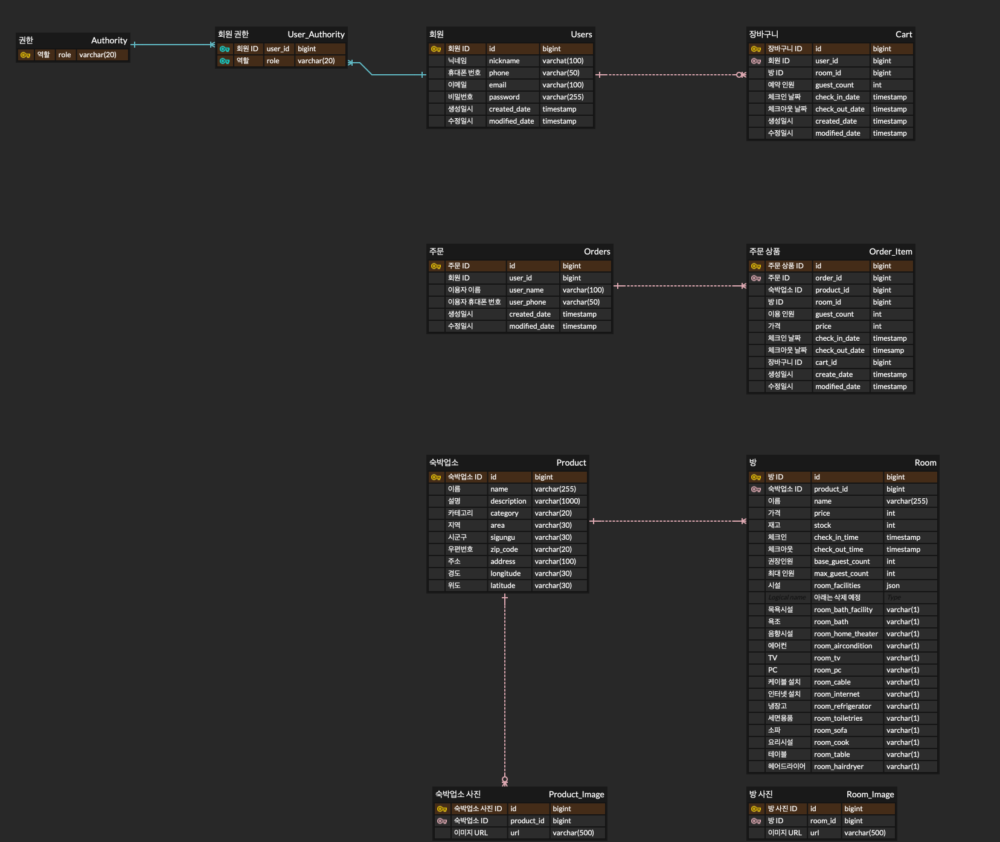

## 프로젝트 소개

- 기간: 2023.11.20 ~ 2023.12.01
- 주제: 숙박 예약 서비스
- 배포 링크
  - 프론트: https://www.stayinn.site
  - 백: https://api.stayinn.site

## 프로젝트 실행 가이드

- 로컬에 6379 포트로 Redis가 실행되고 있어야 합니다.
- 이외에는 추가 설정할 부분 없습니다.

## 조원별 구현 기능

**김진홍**

- API 설계
- JWT 인증 (Spring Security)
  - POST /auth/login 로그인
  - POST /auth/logout 로그아웃
- 회원(User)
  - POST /users 회원가입
  - GET /users 나의 정보 확인
  - DELETE /users 회원 탈퇴
  - PUT /users/password 비밀번호 변경
- 장바구니(Cart)
  - GET /carts 장바구니 담겨져 있는 목록 조회
  - POST /carts 장바구니 담기
  - DELETE /carts 장바구니 아이템 삭제
  - POST /carts/order 장바구니에 있는 아이템들 예약 신청
- 상품(Product)
  - GET /products/{id} 숙박 업소 상세 조회
- 프론트엔드 작업자를 위한 mock 서버 제공
- GitHub Actions를 이용한 구글 코딩컨벤션 및 Gradle 빌드 CI
- 서버 구축 및 CD

**박찬영**

- ERD 설계
- 프로젝트 초기 세팅
  - Layered Architecture 예시 코드 및 틀 코드 작성 (익숙하지 않은 팀원을 위한)
  - 빌드 기본 설정 세팅
  - Spring Security 초기 설정 세팅
- 공통
  - Spring REST Docs 및 테스트에 공통적으로 필요한 부분 추상 클래스 틀 작성
  - 범용적 Redis 사용을 위해 제네릭을 활용한 RedisTemplate 작성
  - 범용적 분산락을 사용하기 위해 Functional Interface를 활용한 Redisson Template 작성
- 주문(Order) 
  - GET /orders/history 주문 내역 목록 조회
  - GET /orders/history/{id} 주문 내역 상세조회
  - GET /orders 예약 신청 조회
- 결제(Payment)
  - POST /orders/payment 예약 결제
- 주문 과정에서 생기는 동시성 이슈 해결
  - Redisson 분산락 사용
  - 병렬 동시 실행하여 정상 동작 검증하는 통합테스트 코드 작성

**김정훈**

- 상품(Product)
  - GET /products 숙박 업소 전체 목록 조회
- JUnit 테스트가 제대로 돌아가지 않는 중대한 버그 발견 및 해결
- RestDocs
  - Product ,Order RestDocs문서화 

## 개발 진행 내용

### ERD

### OpenAPI 연동 과정

> 사용한 OpenAPI: https://www.data.go.kr/data/15101578/openapi.do

1. `/searchStay` 를 이용해 전국의 숙박 정보들의 약 3300개의 `contentid`를 모았습니다. (Postman을 통해 한번에 모두 받아볼 수 있었습니다)
2. 상세정보, 소개정보, 객실정보는 `/detailCommon1`, `/detailIntro1`, `/detailInfo1` API를 통해 각각 3300개(총 9900)의 요청을 보내 모든 정보가 담긴 json을 얻었습니다. (https://pastebin.com/zbRGivs9)
3. 상세 json을 mysql의 INSERT 문으로 변환하였습니다. 변환 과정에서 객실 정보, 객실 이미지, 숙소 이미지 등의 정보가 없는 데이터는 누락시켰더니 500개의 데이터가 남았습니다. (https://pastebin.com/mbgpWzFL)

## KPT 기간 동안 보완한 개발 진행 내용

- 동시성 이슈 해결 및 테스트 코드 작성
  - https://github.com/Dont12/KDT_Y_BE_Mini-Project/pull/74/files
- DELETE /users 회원 탈퇴
- PUT /users/password 비밀번호 변경
- 최근 6개월 이내의 주문 내역만 조회되도록 조건 추가

## 개인 역량 회고

**김진홍**

- Spring Security 이해 부족, 테스트 코드 작성 미숙 등으로 생각보다 개발 진척이 너무 느렸던 것 같아 아쉽습니다.
- 이 점이 너무 아쉬워서 KPT 기간 동안 계속 공부하고 있습니다.

**박찬영**

- 범용적으로 사용하기 위한 클래스를 작성하기 위해 제네릭, 함수형 인터페이스 사용 등 노력했습니다.
- 개념으로만 알고 있던 Redis를 직접 사용해 보고, 공부할 수 있어 좋은 기회였습니다.
- 이번 프록젝트를 진행하면서 구현에 급급해서 적극적으로 소통하지 못한 부분에 대한 아쉬움이 남습니다... 앞으로의 협업 과정에서는 더 적극적으로 소통하기 위해 노력할 것입니다.

**김정훈**

- JPA 에 대한 이해도 부족 + 새로운 아키택쳐 이해로 인해 개발 속도가 느렸었던거같아요.
- 현재 KPT기간동안 JPA 공부중입니다!
